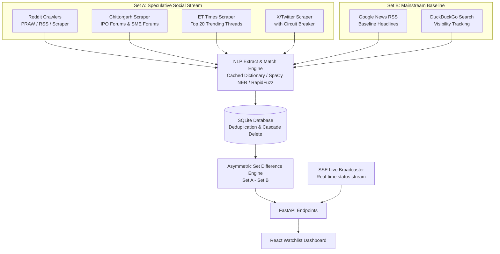

# Early Smoke Reconnaissance Engine

The **Early Smoke Reconnaissance Engine** is a specialized real-time ingestion, NLP parsing, and analytics platform designed to detect early speculative retail asset breakouts in Indian equities (SME and Mainboard IPOs). 

It monitors public discussion forums, social media channels, and mainstream news outlets to find companies experiencing high retail interest (hype/speculation) *before* they are reported in mainstream media.

---

## 🏗️ System Architecture & Data Pipelines

The system is designed as a feature-isolated, vertical slice architecture with a **FastAPI backend** (under `api/`) and a **Vite + React + TypeScript + Tailwind CSS frontend** (under `ui/`).



### 1. Ingestion Pipelines (Set A - Social Stream)
The crawler jobs run periodically (defaulting every 60 minutes) to ingest user comments and posts:
*   **Reddit Ingestion** (`[reddit_worker.py](file:///Users/amitkumardey/Workspace/Projects/alpha-smoke-recon/api/app/features/early_smoke/reddit_worker.py)`): Queries target subreddits (`r/IndianStreetBets`, `r/stocks`, `r/wallstreetbets`). It attempts PRAW API access first, falls back to a BeautifulSoup web scraper for comments and comment trees, and relies on RSS feeds as a zero-auth fallback.
*   **Chittorgarh Forum Scraper** (`[scrapy_spiders.py](file:///Users/amitkumardey/Workspace/Projects/alpha-smoke-recon/api/app/features/early_smoke/scrapy_spiders.py)`): Targets mainboard IPO and SME IPO forums to capture Gray Market Premium (GMP) speculation. Employs a DuckDuckGo search crawl fallback if blocked by Cloudflare/IP blocks.
*   **ET Times Stock Boards Scraper** (`[scrapy_spiders.py](file:///Users/amitkumardey/Workspace/Projects/alpha-smoke-recon/api/app/features/early_smoke/scrapy_spiders.py)`): Crawls the top 20 trending stocks discussion threads. Includes a DuckDuckGo search fallback as well.
*   **Twitter/X Worker** (`[twitter_worker.py](file:///Users/amitkumardey/Workspace/Projects/alpha-smoke-recon/api/app/features/early_smoke/twitter_worker.py)`): Scrapes X/Twitter mentions for trending ticker symbols.
    *   **Circuit Breaker Pattern** (`[circuit_breaker.py](file:///Users/amitkumardey/Workspace/Projects/alpha-smoke-recon/api/app/features/early_smoke/circuit_breaker.py)`): If the Twitter worker encounters 3 consecutive rate limits (HTTP 429) or timeouts, the circuit breaker shifts to `OPEN`. It suspends crawling for Twitter and initiates exponential backoff with jitter. This state degradation is logged in SQLite and returned via the health status API.

### 2. Baseline Tracker (Set B - Mainstream Baseline)
*   **Media Ingestion Pipeline** (`[media_pipeline.py](file:///Users/amitkumardey/Workspace/Projects/alpha-smoke-recon/api/app/features/early_smoke/media_pipeline.py)`): Runs in tandem with the social ingestion to build a mainstream media baseline by crawling Google News RSS headlines and DuckDuckGo search visibility for mapped tickers.

### 3. Corporate Dictionary & Hybrid Ticker Extractor
*   **Memory-cached Dictionary** (`[dictionary.py](file:///Users/amitkumardey/Workspace/Projects/alpha-smoke-recon/api/app/features/early_smoke/dictionary.py)`): On application startup, the system downloads the official NSE corporate listing CSV (`EQUITY_L.csv`) and fallbacks to a local copy if offline. It generates progressive colloquial names, filters out corporate suffixes (e.g. `LTD`, `Limited`), generates acronyms, and builds a clean name-to-ticker index.
*   **Hybrid NER & Fuzzy Matcher** (`[matcher.py](file:///Users/amitkumardey/Workspace/Projects/alpha-smoke-recon/api/app/features/early_smoke/matcher.py)`): 
    1. Runs **SpaCy Named Entity Recognition** (`en_core_web_sm`) on comment text to isolate `ORG` (organization), `PRODUCT`, or `PERSON` entity chunks.
    2. Performs exact dictionary matches on candidate words.
    3. Runs **Levenshtein ratio fuzzy matching** (via `RapidFuzz` with a threshold score $\ge 90\%$) *only* on the SpaCy-extracted entity chunks to match misspelled/colloquial text (e.g. "Infy" $\rightarrow$ `INFY`, "Tata Motors" $\rightarrow$ `TATAMOTORS`) without triggering massive false positives.
    4. Runs an **Absolute Blacklist Filter** to drop common words mimicking tickers (e.g., `YES`, `GOOD`, `ON`, `BUY`, `IPO`).
    5. Offloads intensive tokenization and string matching computations to `asyncio.to_thread` pools to prevent event-loop blocking on CPU-constrained environments (like Hugging Face Spaces).

### 4. Asymmetric Difference & Breakout Analytics
*   **Asymmetric Set Difference** (`[breakout.py](file:///Users/amitkumardey/Workspace/Projects/alpha-smoke-recon/api/app/features/early_smoke/breakout.py)`): The core engine extracts the set of tickers mentioned in social forums ($Set\_A$) and the set of tickers in mainstream media ($Set\_B$) over a trailing sliding window (default 7 days). It computes the difference:
    $$\text{Breakout\_Tickers} = Set\_A \setminus Set\_B$$
*   **Breakout Alpha Score**: For each breakout ticker, a weighted score is computed based on signal weight, match confidence, and sentiment value:
    $$\text{Alpha} = \sum (\text{engagement\_weight} \times \text{match\_confidence} \times (1.0 + \text{sentiment\_score}))$$
    *   Engagement Weights (configurable in `[config.yaml](file:///Users/amitkumardey/Workspace/Projects/alpha-smoke-recon/api/config.yaml)`):
        *   Reddit thread body: `1.0`
        *   Reddit nested comment: `0.5`
        *   Message board comment: `0.8`
        *   Twitter tweet: `0.4`

### 5. SSE Live Activity Broadcaster
*   **Real-time Broadcaster** (`[broadcaster.py](file:///Users/amitkumardey/Workspace/Projects/alpha-smoke-recon/api/app/features/early_smoke/broadcaster.py)`): Exposes a Server-Sent Events (SSE) stream endpoint `GET /api/features/early-smoke/stream`. Any scheduled crawler triggers, DB inserts, dictionary cache events, or circuit-breaker status changes are pushed instantly to the UI console.

### 6. Sliding Window Purge Engine
*   **Cleanup Service** (`[purge.py](file:///Users/amitkumardey/Workspace/Projects/alpha-smoke-recon/api/app/features/early_smoke/purge.py)`): A background task that runs once every 24 hours to delete database records older than the configured retention threshold (default 10 days) and runs an SQL `VACUUM` command to reclaim storage.

---

## 📂 Project Directory Structure

```text
alpha-smoke-recon/
├── specs/                         # Specifications & design documentation
│   └── 001-early-smoke/
│       ├── spec.md                # Feature specification
│       ├── plan.md                # Technical implementation plan
│       ├── data-model.md          # Database structure details
│       ├── quickstart.md          # Quick validation commands
│       └── contracts/             
│           └── api.md             # Backend API endpoint definitions
│
├── api/                           # FastAPI Backend Application
│   ├── app/
│   │   ├── main.py                # Server entry point, startup/shutdown hooks
│   │   ├── db.py                  # Database connection setup
│   │   ├── config.py              # Configuration loading logic
│   │   └── features/
│   │       └── early_smoke/       # Feature-isolated backend slice
│   │           ├── models.py      # SQLAlchemy models (Signal, Mention, etc.)
│   │           ├── schemas.py     # Pydantic validation schemas
│   │           ├── router.py      # HTTP routes and SSE stream endpoints
│   │           ├── dictionary.py  # Stock directory loader & acronym mappings
│   │           ├── matcher.py     # SpaCy & RapidFuzz extraction matcher
│   │           ├── scheduler.py   # APScheduler configuration
│   │           ├── breakout.py    # Asymmetric Set Difference engine logic
│   │           ├── purge.py       # Data purging & SQLite vacuuming
│   │           ├── reddit_worker.py   # Reddit scraping worker
│   │           ├── scrapy_spiders.py  # Chittorgarh & ET Times crawling
│   │           ├── twitter_worker.py  # X/Twitter crawler
│   │           ├── media_pipeline.py  # Google News RSS & DDG search tracking
│   │           ├── broadcaster.py # SSE subscriber logic
│   │           ├── circuit_breaker.py # Twitter scraper circuit breaker
│   │           └── tests/         # Pytest unit & integration test suites
│   ├── config.yaml                # Editable configurations (weights, retention)
│   ├── pyproject.toml             # Python dependencies managed by uv
│   └── Dockerfile                 # Hugging Face deployment container setup
│
└── ui/                            # React + TypeScript Frontend Application
    ├── src/
    │   ├── App.tsx                # Main mount point
    │   ├── main.tsx               # Client entry point
    │   ├── index.css              # Custom styling & Tailwind imports
    │   └── features/
    │       └── early_smoke/       # Feature-isolated frontend slice
    │           ├── components/
    │           │   ├── WatchlistDashboard.tsx # Primary dashboard view (Hype & Most Discussed tabs)
    │           │   ├── BreakoutCard.tsx       # Detail card for individual stocks
    │           │   ├── MentionChart.tsx       # Timeline trend charts using Recharts
    │           │   ├── SystemStatusBanner.tsx # Visual indicator for database, scheduler & breaker
    │           │   └── ActivityConsole.tsx    # Live SSE activity stream visual console
    │           ├── hooks/         # React hooks for API endpoints
    │           └── types.ts       # TypeScript type contracts matching backend schemas
```

---

## ⚡ Setup & Installation

### Prerequisites
*   Python 3.11+
*   Node.js 18+
*   `uv` Package Manager (recommended for python speed):
    ```bash
    curl -LsSf https://astral.sh/uv/install.sh | sh
    ```

### Backend Installation & Startup
1. Navigate to the backend folder:
   ```bash
   cd api
   ```
2. Install Python dependencies and sync virtual environment:
   ```bash
   uv sync
   ```
3. Run the FastAPI development server:
   ```bash
   uv run uvicorn app.main:app --reload --port 8000
   ```
   *The server runs at `http://localhost:8000`. You can inspect the interactive OpenAPI documentation at `http://localhost:8000/docs`.*

### Frontend Installation & Startup
1. Navigate to the frontend folder:
   ```bash
   cd ../ui
   ```
2. Install dependencies:
   ```bash
   npm install
   ```
3. Run the Vite development server:
   ```bash
   npm run dev -- --port 3000
   ```
   *Open `http://localhost:3000` to view the interactive dashboard.*

---

## 🧪 Verification & Walkthrough

The following walkthrough outlines the steps to verify the entire system functionality and data pipelines.

### Part 1: Automated Unit & Integration Tests

From the `api/` directory:

1.  **Scenario A: Ingestion & Fuzzy Ticker Resolution**
    Verify that the matching engine extracts colloquial references and ignores blacklisted words.
    ```bash
    uv run pytest app/features/early_smoke/tests/test_ingestion.py
    ```
    *   *What it tests*: Verifies that text like `"Buying Infy at CMP"` is mapped to `INFY`, and that words like `"YES"` or `"GOOD"` are successfully dropped to avoid ticker collisions.

2.  **Scenario B: Asymmetric Set Difference & Breakout Analytics**
    Verify that the breakout calculation matches $Set\_A \setminus Set\_B$.
    ```bash
    uv run pytest app/features/early_smoke/tests/test_breakout.py
    ```
    *   *What it tests*: Feeds identical social and media signals, computes the asymmetric difference, and asserts that only items unique to the social stream make it to the Breakout Watchlist.

3.  **Scenario C: Database Purge & Vacuuming**
    Verify that records older than the configured window are pruned and the database space is reclaimed.
    ```bash
    uv run pytest app/features/early_smoke/tests/test_purge.py
    ```
    *   *What it tests*: Inserts 11-day-old mock entries, runs the database cleanup job, confirms that the DB count drops to zero for old items, and calls `VACUUM` to verify space optimization.

---

### Part 2: Manual Dashboard Walkthrough

Once both backend and frontend servers are running:

1.  **Open the Web Dashboard**: Navigate to `http://localhost:3000` in your web browser. You should be presented with a premium, dark-themed dashboard showing speculative market activity.
2.  **Inspect the Hype Breakout Watchlist (Set A - Set B)**:
    *   The **Hype Breakouts** tab lists stocks mentioned on social media but absent from mainstream news.
    *   Look at the **Breakout Alpha Score** to see how the signal engagement weight, mention count, and sentiment contribute to the rating.
    *   Click on any asset card to view its **Mention Timeline Chart** (historical trends) and its **Source Distribution** (Reddit, Twitter, Chittorgarh, ET Times).
3.  **Inspect the Most Discussed Tab**:
    *   Toggle to the **Most Discussed** view. This table lists the highest overall ticker mentions across both mainstream media (Google News, DuckDuckGo) and social media combined.
4.  **Monitor Live Ingestion via Activity Console**:
    *   Look at the floating/collapsible console on the right side of the dashboard.
    *   As background crawlers run, you will see live log statements and events pushed in real-time via Server-Sent Events (SSE).
5.  **Check System Health Status**:
    *   The **System Status Banner** at the top displays the overall health state (`Healthy` or `Degraded`).
    *   It lists active background scheduler jobs and SQLite database size.
    *   If the Twitter scraper is rate-limited, the Twitter Circuit Breaker turns `OPEN` (red badge) and displays a warning, indicating that the system is operating in a gracefully degraded state while other scrapers continue to ingest data safely.
