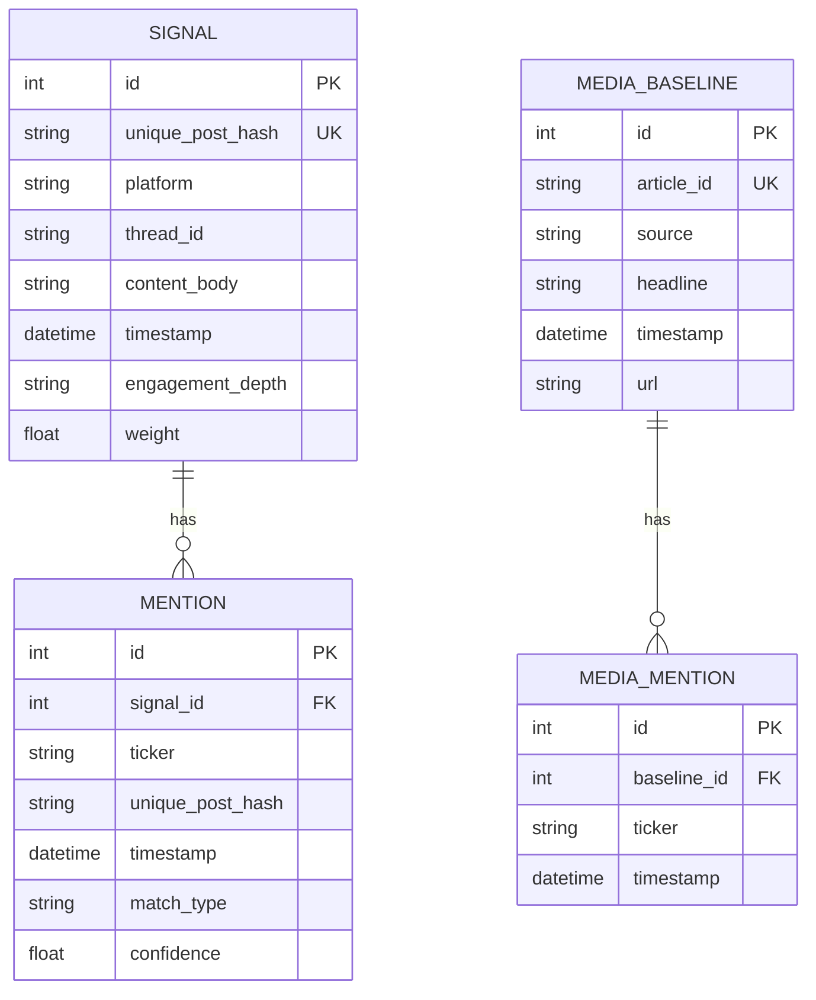

# Data Models: Early Smoke Reconnaissance Engine

This document defines the database tables and schemas for data storage.

## Entity Relationship Diagram

## Database Schema (SQLAlchemy Mapping)

### Signals Table
Represents comments, posts, and threads scraped from retail social media channels.
*   `id`: `Integer`, Primary Key.
*   `unique_post_hash`: `String`, Unique, Index. Hash of `platform + thread_id + timestamp + cleaned_comment_text`.
*   `platform`: `String` (e.g., 'reddit', 'twitter', 'chittorgarh', 'et_times').
*   `thread_id`: `String`.
*   `content_body`: `Text`.
*   `timestamp`: `DateTime`.
*   `engagement_depth`: `String` (e.g. 'thread_body', 'nested_comment', 'tweet').
*   `weight`: `Float` (computed based on depth).

### Mentions Table
Stores specific ticker extraction matches linked back to the social signal.
*   `id`: `Integer`, Primary Key.
*   `signal_id`: `Integer`, ForeignKey('signals.id').
*   `ticker`: `String`. Official exchange ticker (e.g., `INFY`).
*   `unique_post_hash`: `String`. Cached copy of the signal's unique hash.
*   `timestamp`: `DateTime`. Cached copy of the signal's timestamp.
*   `match_type`: `String` (e.g., 'fuzzy', 'exact').
*   `confidence`: `Float`.
*   **Composite Index**: `idx_ticker_hash_time` declared over `(ticker, unique_post_hash, timestamp)`.

### Media Baseline Table
Stores mainstream articles and search results scraped for the baseline comparison.
*   `id`: `Integer`, Primary Key.
*   `article_id`: `String`, Unique, Index. Hash of publication source, date, and headline.
*   `source`: `String` (e.g., 'google_news', 'duckduckgo').
*   `headline`: `Text`.
*   `timestamp`: `DateTime`.
*   `url`: `String`.

### Media Mentions Table
Stores specific ticker extractions found within the mainstream media baseline.
*   `id`: `Integer`, Primary Key.
*   `baseline_id`: `Integer`, ForeignKey('media_baselines.id').
*   `ticker`: `String`.
*   `timestamp`: `DateTime`.

---

## Validation & Business Rules

1.  **Deduplication Constraint**: If an incoming social signal has a `unique_post_hash` that matches an existing record in `signals`, the record is ignored.
2.  **Cascading Deletes**: When a record in `signals` or `media_baselines` is deleted by the Sliding Window Purge Engine, all linked `mentions` or `media_mentions` must be cascade-deleted.
3.  **Composite Index Purpose**: The composite index on `(ticker, unique_post_hash, timestamp)` optimizes sliding-window aggregations (counting occurrence densities per ticker over a specific time range).
